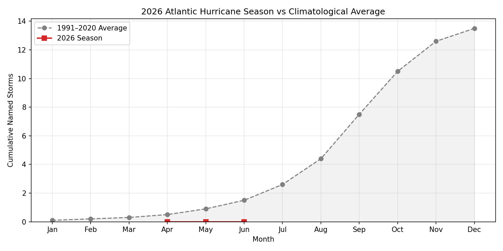

# 🌀 Atlantic Hurricane Season Tracker

*Last updated: 2026-04-10 12:36 UTC*

---

## Active Tropical Systems

*No active tropical cyclones in the Atlantic basin.*

---

## 2026 Season Statistics

| Metric | Count | Avg (1991–2020) |
|--------|------:|:---------------:|
| Named Storms | **0** | 14.4 |
| Hurricanes | **0** | 7.2 |
| Major Hurricanes (Cat 3+) | **0** | 3.2 |

---

## Sea Surface Temperature — Main Development Region

**Current SST anomaly (MDR, 10°N–20°N / 20°W–60°W):** +0.36 °C

---

## Season Progress Chart

---

## Data Sources

- [NOAA National Hurricane Center](https://www.nhc.noaa.gov/)
- [NOAA CPC SST Indices](https://www.cpc.ncep.noaa.gov/data/indices/)
- Climatological averages: NOAA/NHC 1991–2020 base period
