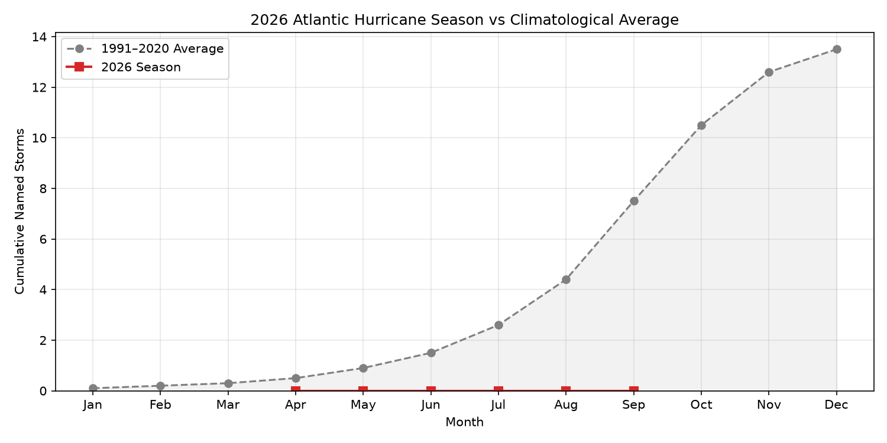

# 🌀 Atlantic Hurricane Season Tracker

*Last updated: 2026-09-01 12:38 UTC*

---

## Active Tropical Systems

### Summary for Tropical Storm Edouard (AT5/AL052026)

- **Max sustained winds:** see advisory mph
- **Movement:** ...AIR FORCE HURRICANE HUNTERS INVESTIGATING EDOUARD... ...SIGNIFICANT STRENGTHENING IS FORECAST BEFORE EDOUARD REACHES 

### Tropical Storm Edouard Public Advisory Number 4a

- **Max sustained winds:** see advisory mph
- **Movement:** ...AIR FORCE HURRICANE HUNTERS INVESTIGATING EDOUARD... ...SIGNIFICANT STRENGTHENING IS FORECAST BEFORE EDOUARD REACHES 

### Tropical Storm Edouard Forecast Advisory Number 4

- **Max sustained winds:** see advisory mph
- **Movement:** Issued at 0900 UTC TUE SEP 01 2026

### Tropical Storm Edouard Forecast Discussion Number 4

- **Max sustained winds:** see advisory mph
- **Movement:** Issued at 400 AM CDT Tue Sep 01 2026

### Tropical Storm Edouard Wind Speed Probabilities Number 4

- **Max sustained winds:** see advisory mph
- **Movement:** Issued at 0900 UTC TUE SEP 01 2026

### Tropical Storm Edouard Graphics

- **Max sustained winds:** see advisory mph
- **Movement:**  
 <a href="https://www.nhc.noaa.gov/refresh/graphics_at5+shtml/120138.shtml?tswind120">
<img src="https://www.nhc.noaa.gov/ima

### Tropical Storm Edouard Information by ATCF XML Prototype

- **Max sustained winds:** see advisory mph
- **Movement:** Issued at Tue, 01 Sep 2026 11:48:50 GMT. This is only a prototype and the file format may change without notice.

---

## 2026 Season Statistics

| Metric | Count | Avg (1991–2020) |
|--------|------:|:---------------:|
| Named Storms | **0** | 14.4 |
| Hurricanes | **0** | 7.2 |
| Major Hurricanes (Cat 3+) | **0** | 3.2 |

---

## Sea Surface Temperature — Main Development Region

**Current SST anomaly (MDR, 10°N–20°N / 20°W–60°W):** +0.90 °C

---

## Season Progress Chart

---

## Data Sources

- [NOAA National Hurricane Center](https://www.nhc.noaa.gov/)
- [NOAA CPC SST Indices](https://www.cpc.ncep.noaa.gov/data/indices/)
- Climatological averages: NOAA/NHC 1991–2020 base period
